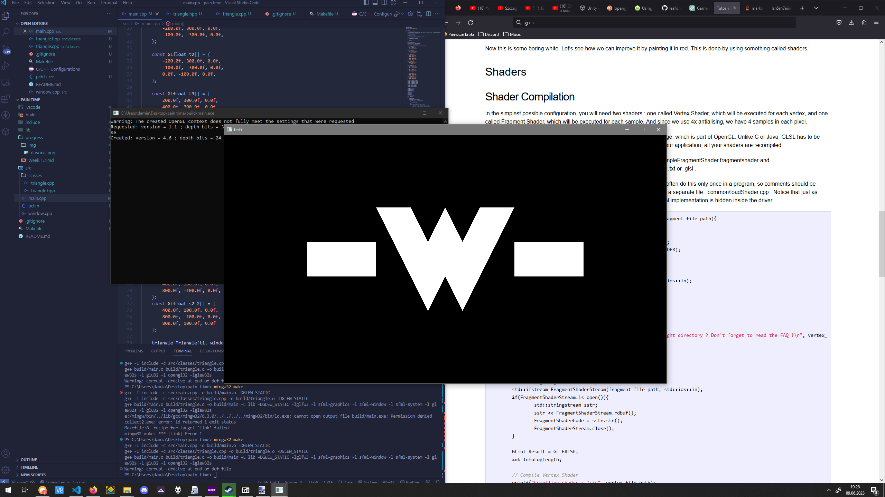

*please keep in mind, these are* ***my*** *notes, this is not a guide, this is for my own self, if this helps you, good for you :D.*

# Day 1 of my 8th attempt on making a Game Engine:

So, I managed to make this lil triangle so far, while understanding most of the stuff that's happening, also saving this to remember about how positions work in openGL:

> The first vertex is (-1,-1,0). This means that unless we transform it in some way, it will be displayed at (-1,-1) on the screen. What does this mean ? The screen origin is in the middle, X is on the right, as usual, and Y is up. This is what it gives on a wide screen


*few hours later*

I MANAGED TO MAKE A -w- FACE USING THIS SHIT :3



*~4 more hours later*

I have made it bounce, and I'm proud of it. (this was such a pain to make, the triangle::place function mainly for some reason)

## Notes to self:
- Remember to initialize GLEW after the window gets activated and before you create any VAOs
```cpp
    GLenum glewInitResult = glewInit();
    if (glewInitResult != GLEW_OK)
    {
        // GLEW initialization failed
        return -1;
    }
```
- makefiles are a mess

# Day 2

so i have learnt how shaders work, mainly fragment shaders, right now I dont have a big understanding of vertex shaders, AND I MANAGED TO MAKE THE LIL FACE PULSE IN PINK HAAAAAAA


I AM LEARNING ALL THAT MATRIX STUFF AND I HAVE MANAGED TO MAKE IT SPIN YEEEEEEEEEEEEEEEEEEEAAAAA

i have learnt to make a shake effect and all that stuff, pretty cool huh?

# Day 3

finally made it so i can do stuff like shake the screen and move the camera at the same time, because apparently im dumb LMAO. fixed the aspect ratio issue ive been dealing with a lot, i literally divided all the vertices by the window sizes so that it wouldnt look fat without knowing that the perspective stuff does that already. I didn't do much today because i actually wanted to take a break today, but I got hit with some really strong motivation so I decided to keep working on this.

## Notes to self:
- you can literally multiply ANY transformation matrix (so like a translation, camera shake, anything really) when youre making the mvp
so for example you can make a seperate matrix for each effect, each transformation and then multiply it all once making the mvp matrix, example:
```cpp
// other stuff 

glm::vec3 translation = shake(time, intensity, speed);
glm::mat4 shakeMatrix = glm::translate(glm::mat4(1.0f), translation);     

// ...

glm::mat4 moveMatrix = glm::translate(glm::mat4(1.0f), {1.f, 0.f, 0.f})

// ...

// and then in the end we can sum all that together into the mvp

glm::mat4 mvp = Projection * View * Model * shakeMatrix * moveMatrix;
```
- do **NOT** handle the aspect ratio yourself, let the perspective view matrix do it for you, so `glm::perspective(glm::radians(fov), aspectRatio, nearPlane, farPlane);`

 ### Cheat sheet of the matrix functions i should know:
#### Translation
 ```cpp
 glm::mat4 glm::translate(glm::mat4(1.0f), glm::vec3 translation);
 ```
#### Rotation
```cpp
glm::mat4 glm::rotate(glm::mat4(1.0f), float angle, glm::vec3 axis);
```
*keep the angle in radians, use the `glm::radians(float degrees);` function to convert to radians*
#### Scaling
```cpp
glm::mat4 glm::scale(glm::mat4 matrix, glm::vec3 scale);
```

#### Perspective Projection
```cpp
glm::mat4 glm::perspective(float fov, float aspect, float near, float far);
```
*the aspect ratio is equivalent to resolution.x / resolution.y*
*as for the near and far variables, im gonna save this here incase its useful: 0.1f, 100.0f*
*keep the fov in radians, use the `glm::radians(float degrees);` function to convert to radians*

#### Ortho Projection
```cpp
glm::mat4 glm::ortho(float left, float right, float bottom, float top, float near, float far);
```

#### LookAt (View matrix)
```cpp
glm::mat4 glm::lookAt(glm::vec3 eye, glm::vec3 target, glm::vec3 up);
```
*the up vector represents which direction is considered to be "up", so normally it would be `glm::vec3(0,1,0)`, and if you wanted it to be upside down, then just type `glm::vec3(0,-1,0)` (so essentially the negative side of the y axis is considered to be the "up" side)*

# ~~Day 4~~

today this day was pretty overwhelming for me (monday), so i'm taking a break on this day.

# Day 5

i made a `triangleManger` class, works pretty well until i realised it wont be very easy to make a `place` function that also takes all transformations from the model matrix into consideration, this will be very tough.

decided to add an `update(glm::mat4 transformation)` function to the `triangle` class for the sake of making stuff easier, however this was very hard to do considering the trianglemanager class is really bad and needs an overhaul most likely.
this whole function probably took me around 3 hours to make. 
## Notes to self:
- the VAO and VBO are responsible for sending the data to the shader, which is why you can send the model matrixes sepperately for each trianglem and even if we were to "unfold" (idk programming terms that well ok thank u) the code behind it, it would look like this:
```cpp
    // ...

    glm::mat4 mvp = mv * model;

    shader.Set4fv("MVP", mvp);

    triangle1.draw();

    glm::mat4 mvp = mv * model;

    shader.Set4fv("MVP", mvp);

    triangle2.draw();

    glm::mat4 mvp = mv * model;

    shader.Set4fv("MVP", mvp);

    triangle3.draw();

    // ...
```
thats why you can transform a sepperate triangle using a model matrix.
```cpp
    // ...

    glm::mat4 mvp = mv * model;

    shader.Set4fv("MVP", mvp);

    triangle1.draw();

    glm::mat4 transformation = glm::translate(glm::mat4(1.0f), glm::vec3(1.0f, 2.0f, 0.0f))
    glm::mat4 mvp = mv * model * transformation;

    shader.Set4fv("MVP", mvp);

    triangle2.draw();
    // ...
```

## Plans for tommorow:
- finishing the place function maybe? (remember to multiply the coordinates by the inverse transformation matrices, as the coords will be in model space, and the place function will modify the vertex data directly, because idk how else to do it)
- Adding imgui for better experimentation and debugging,
- Learning interpolation

# ~~Day 6~~

sorry, exhausting day, holidays will start in around 2 days tho so expect a lot more progress soon

# ~~Day 7 (+ a few others)~~

busy.